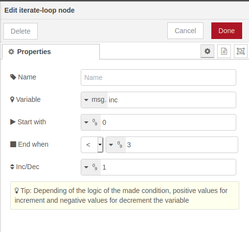

# node-red-contrib-iterate-loop
Node-RED node to build loops and interact with others nodes in a flow.
Basically working like a `for loop`.

## Config iterate-loop
Below are the inputs properties required to make it possible.

- Variable name, that can be associated to a context variable(`msg`, `flow`, `global`).
- Value to start the loop, can be a number or a variable from a context(`msg`, `flow`, `global`).
- Condition to finish the loop, choosing from an operator (`==`, `<`, `<=`, `>`, `>=`) and a value to compare with (`number`, `msg`, `flow`, `global`).
- Increment/Decrement value (`number`, `msg`, `flow`, `global`). Note: for decrement is enough with enter negative values and for increment positive values.

The loop will continue as long as the condition it is `TRUE`, throwing an output to the output label `continue` in each iteration.
When the condition changes to `FALSE` the loop will terminate an the output will be send to the output label `exit`

## Basic example
With an example can be more straightforward to understand how this node works, the flow is available in the example folder of this repo.

node0.png - *node in resting mode*

node1.png - *looping status*

node2.png - *terminated loop status*

node-output.png - *output from debug messages*

node-output.png - *configuration properties of the node*

## License
[Apache 2.0](./LICENSE).
